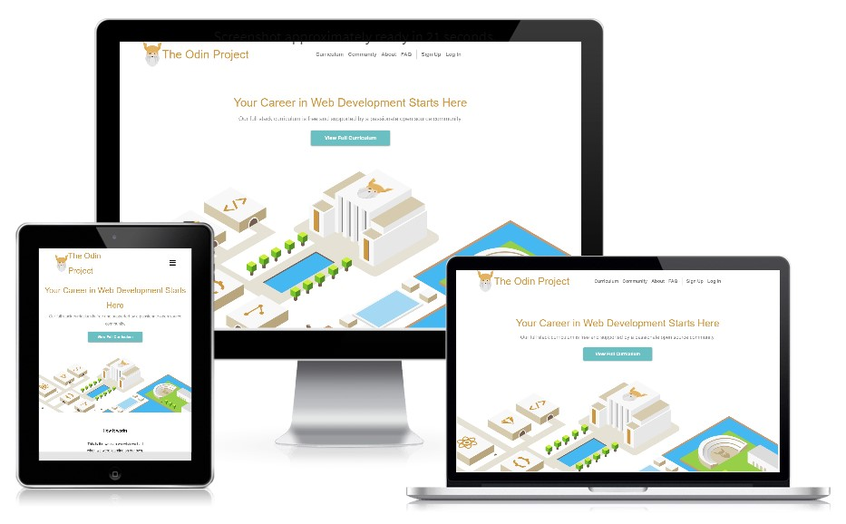

# Grid-Framework

Designing a Sass based grid framework.

Example page created with the framework:

[Live preview](https://htmlpreview.github.io/?https://github.com/BenjaminGarza/Grid-Framework-Design/blob/Getting-Started/index.html)

[Asignment Link](https://www.theodinproject.com/courses/html5-and-css3/lessons/design-your-own-grid-based-framework).

Authors:

[@MauricioRobayo](https://github.com/MauricioRobayo)
[@benjamingarza](https://github.com/BenjaminGarza)
